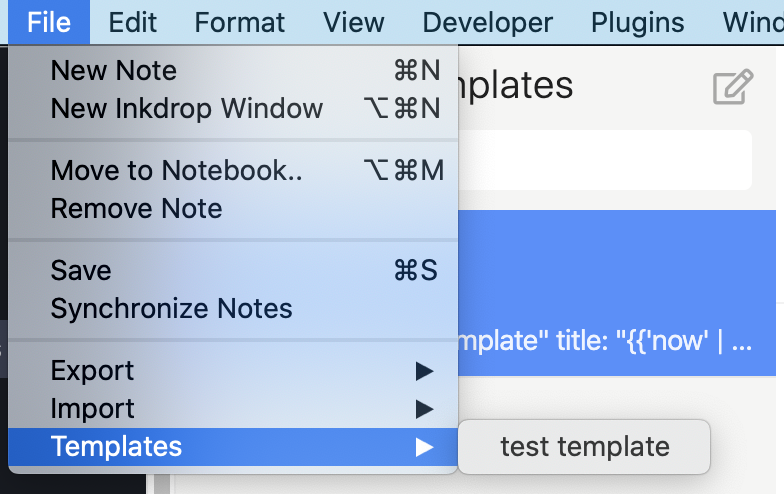

# inkdrop-note-templates

Note template system for [Inkdrop](https://inkdrop.app).

## Installation

    ipm install inkdrop-note-templates

## Usage

### Create Templates

You need to create note template in `_Template` book of your inkdrop.

1. Create new "_Templates" notebook
2. Add note as template  

Note template should have content and metadata as [Yaml Front Matter](https://jekyllrb.com/docs/front-matter/).

- `id`: unique id for [command](https://docs.inkdrop.app/manual/list-of-commands)
- `label`: Menu label for the template
- `title`: Render title with [LiquidJS](https://liquidjs.com/) and set it as new note's title 
- body`: Render body with [LiquidJS](https://liquidjs.com/) and set it as new note's body
 
```markdown
---
id: test
label: "Test Template"
title: "Test Title"
---

Test body text.

- item 1
- item 2
```

inkdrop-note-templates use [LiquidJS](https://liquidjs.com/).
so, You can use template syntax in `title` and body.

```markdown
---
id: today-task
label: "Today Task"
title: "{{'now' | date: '%Y-%m-%d'}} Taks"
---

## TODO

- [ ] TASK
```

### Use Templates

You can create new note from "File" > "Templates" > your templates.



:warning: If you have updated your template, Please restart inkdrop application.

#### Shortcut for Template

Call `inkdrop-note-templates:${template.id}` from shortcut and create a new note with the template.

You open your [keymap.cson](https://docs.inkdrop.app/manual/customizing-keybindings) and edit it.

Following example create new file with `id: today-task` template.

```cson
'body':
  'cmd-shift-e': 'inkdrop-note-templates:today-task'
```

## Contributing

1. Fork it!
2. Create your feature branch: `git checkout -b my-new-feature`
3. Commit your changes: `git commit -am 'Add some feature'`
4. Push to the branch: `git push origin my-new-feature`
5. Submit a pull request :D

## License

MIT

## References

- [Creating a Note Template | Inkdrop Documentation](https://docs.inkdrop.app/manual/creating-a-note-template)
